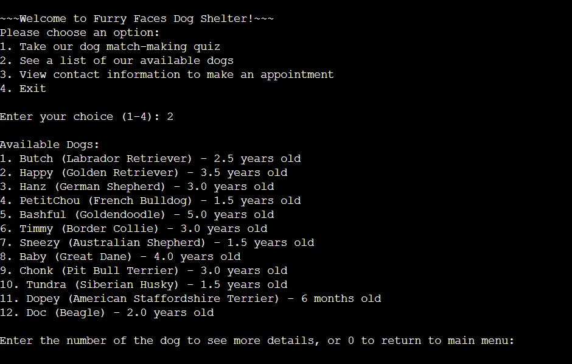

## 📂 **Dog Shelter Match-making Service (Java, July 2025)**

**Description**
A Java application that helps match adopters with shelter dogs through a quiz-based system.

**Tech Stack**

* Java
* File I/O with CSV databases

**Features**

* Quiz-driven matching algorithm with scoring system
* OOP principles: Inheritance, Encapsulation, Polymorphism
* CSV databases for breeds, residents, users, and quiz results
* Menu-driven interface with input validation
* Includes unit testing and debugging for reliability

**How to Run**

```bash
git clone https://github.com/cvcpatton/dog-match.git
cd dog-match
javac Capstone_patton.java
java Capstone_patton
```

**Sample Output**




# 📜 License

**Copyright © 2025 Catherine V.C. Patton**

This project is provided for educational and portfolio purposes only.

* ✅ You may **view, clone, and run** this code for personal or educational use.
* ✅ You must **give proper credit** if referencing or sharing this project.
* ❌ You may **not use this code for commercial purposes** without written permission.
* ❌ You may **not redistribute modified versions** of this project without permission.

For questions about licensing or permissions, please contact:
📧 [catcar\_333@yahoo.com](mailto:catcar_333@yahoo.com)
